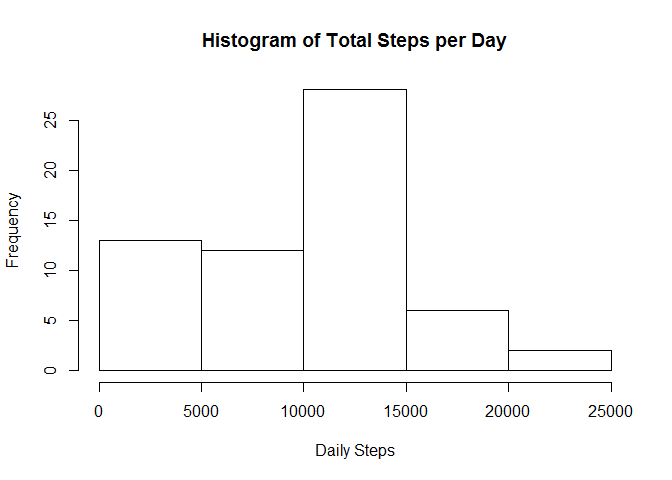
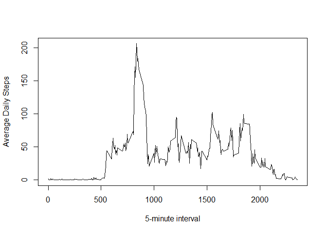
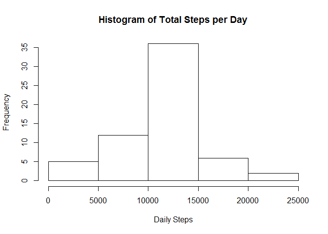
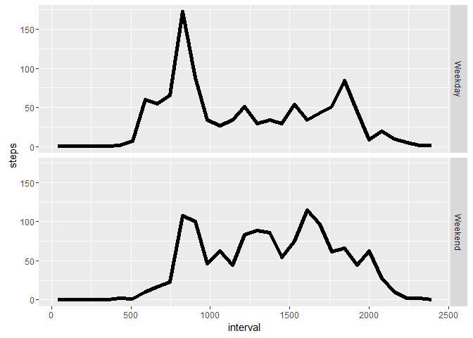

# Reproducible Research: Peer Assessment 1


## Loading and preprocessing the data
Read in data

```r
activity <- read.csv(unz("activity.zip","activity.csv"))
```


## What is mean total number of steps taken per day?

1. Get the total steps taken per day. 

```r
daily_steps <- with(activity, tapply(steps, date, sum, na.rm=TRUE))
```

2. Create Histogram of total steps per day.

```r
hist(daily_steps, main = "Histogram of Total Steps per Day", xlab = "Daily Steps")
```

<!-- -->

3. Calculate the mean and median number of steps per day.

Here is the mean

```r
mean(daily_steps)
```

```
## [1] 9354.23
```

Here is the median

```r
median(daily_steps)
```

```
## [1] 10395
```


## What is the average daily activity pattern?
Here is a plot of the average steps by 5-minute interval

```r
by_interval <- with(activity, tapply(steps, interval, mean, na.rm=TRUE))
plot(x=names(by_interval), y=by_interval, type="l", xlab = "5-minute interval", ylab= "Average Daily Steps")
```

<!-- -->

On average, the most number of steps occur at 8:35 am

```r
by_interval[by_interval==max(by_interval)]
```

```
##      835 
## 206.1698
```


## Imputing missing values
Some days have missing values, which may introduce bias into the average steps.

In total there are 2,304 missing values.

```r
sum(is.na(activity$steps))
```

```
## [1] 2304
```

One solution is to use the average number of steps for the 5-minute interval to replace the missing value.

```r
## putting the updated values in a new variable "steps2"
activity$steps2 <- activity$steps
## determine which indeces have missing values
na_index <- which(is.na(activity$steps))
## replace missing values
for(i in na_index){
    activity$steps2[i] <- by_interval[as.character(activity$interval[i])]
}
```

New data set: activity2 with missing values replaced

```r
activity2 <- activity[,2:4]
names(activity2)[3] <- names(activity)[1]
```


Look at histogram of total steps per day 

```r
##  Get total steps per day
daily_steps2 <- with(activity2, tapply(steps, date, sum, na.rm=TRUE))

## Create Histogram of total steps per day.

hist(daily_steps2, main = "Histogram of Total Steps per Day", xlab = "Daily Steps")
```

<!-- -->

Calculate the mean and median number of steps per day.

Previously we calculated the mean to be 9354.23

Replacing missing values increases the mean:

```r
mean(daily_steps2)
```

```
## [1] 10766.19
```

Previously we calculated the median to be 10395

Replacing missing values also increases the median:

```r
median(daily_steps2)
```

```
## [1] 10766.19
```


## Are there differences in activity patterns between weekdays and weekends?

Using the new data set with imputed missing values.

Create new variable determining "weekday" vs. "weekend"

```r
dayofWeek <- weekdays(as.Date(activity$date))
weekend <- c("Saturday","Sunday")
activity2$days <- as.factor(ifelse(dayofWeek %in% weekend, c("Weekend"), c("Weekday")))
```

Finally, let's look at average steps by interval for weekdays vs. weekends.


```r
library(ggplot2)
g <- ggplot(activity2, aes(x=interval, y=steps, group = days))
g + stat_summary_bin(fun.y = "mean", geom = "line",lwd=2, lty=1) +
    facet_grid(days ~.)
```

<!-- -->


